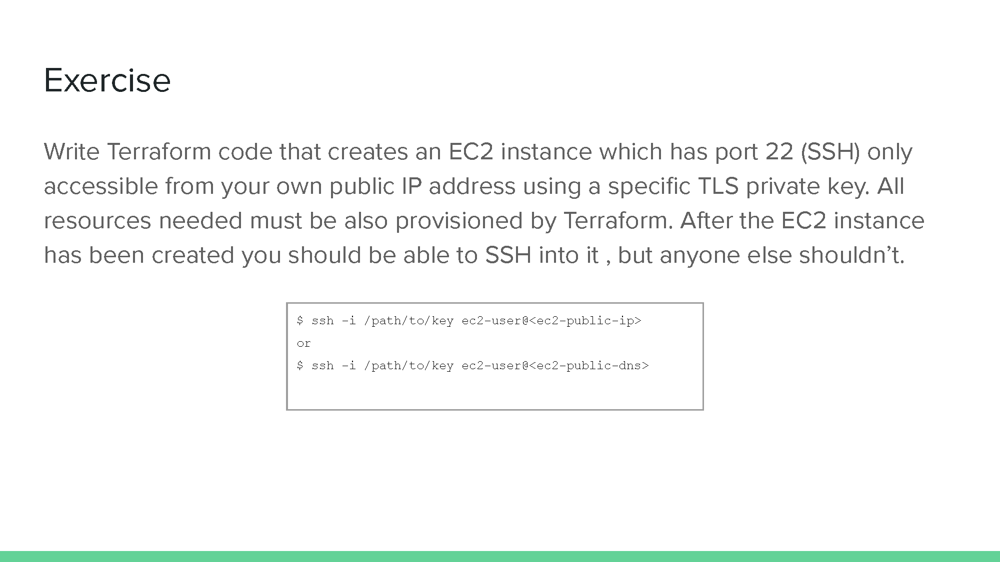

# Devtools Day 4 Assignment

Day 4 assignment for the subject Fundamentals in Developer Tools in PowerX Program




## Instructions 

Requires: 

1. Terraform 1.0.5 
2. AWS CLI with login credentials configured 

### First Time Setup 

If you are loading this for the first time, follow these instructions to set things up. 

1. Make the following changes to `providers.tf`: 
   Line 10 change to

   ```terraform
   backend "local" {
   ```

2. Run the following commands: 

   ```shell
   terraform init
   terraform plan
   terraform apply
   ```

3. Create an EC2 Key-Pair by running the command below: 

   ```shell
   aws ec2 create-key-pair --key-name devtools4 --query 'KeyMaterial' --output text > devtools4.pem
   chmod 400 devtools4.pem
   ```

   Here, the name of the key is "devtools4". 

4. Make the following changes to `providers.tf`: 
   Line 10 change back to

5. ```terraform
   backend "s3" {
   ```

6. Run the following command to migrate the local state to S3 bucket

   ```shell
   terraform init -migrate-state
   ```

7. Login to AWS console and check if the S3 bucket is created with the name "`terraform-state-bucket-alkaff`" and with 1 object "`devtools-day4.tfstate`" 

### Running the Terraform Infrastructure 

1. Run the following commands: 

   ```shell
   terraform init
   terraform plan
   terraform apply
   ```

   This will spin up an EC2 Instance. on the console, the Public and Private IP address will be printed. 

2. SSH into the Public IP Address: 

   ```shell
   ssh -A -i "devtools4.pem" ec2-user@[public_ip]
   ```

3. SSH into the Private IP Address: 

   ```shell
   ssh -i "devtools4.pem" ec2-user@[private_ip]
   ```

